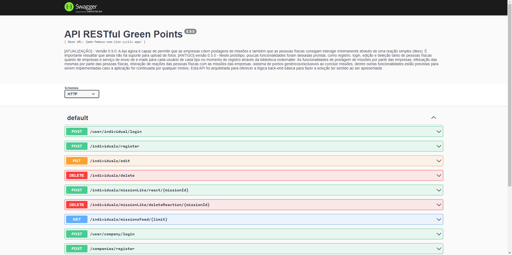

## API RESTful

- Back-end simples para o web-app Green Points.

---

### API desenvolvida durante evento da ProviHack 2022 - Não existe planeta B.

#### Para testar em servidor online:

- Encontrei um serviço gratuíto para hospedar minhas APIs e até agora não encontrei nenhuma limitação com o tempo de uso destes serviços. Espero que esse serviço permaneça gratuíto por muito tempo. O link para acessar a interface Swagger da API com as rotas documentadas é esta: https://jade-famous-sea-lion.cyclic.app/docs/

---

- Tecnologias usadas:

  > Node.js, Javascript e PostgreSQL

- Bibliotecas principais:
  > Express.js, Node-postgres (pg), Knex.js, Nodemailer.js, Bcrypt, Jsonwebtoken e Yup.

 #### - O que precisa ser feito para que a api funcione localmente?
 
      1° - Baixe a engine (motor) que interpretará as funcionalidades das dependências em javascript, o Node, através deste link: https://nodejs.org/en/download/
      2° - Selecione o instalador de acordo com o seu sistema operacional e arquitetura (32-bit ou 64-bit)
      3° - Ao abrir o instalador do Node, pressione o botão "next" até aparecer a opção de instalar um software chamado "Chocolatey". Não instale ele e prossiga até o final.
      4° - Baixe e instale um banco de dados SQL, eu recomendo o PostgreSQL. Link de um tutorial atualizado e simples: https://www.hashtagtreinamentos.com/instalacao-do-postgresql-sql.
      5° - Clone este repositório para o seu computador, vá até a pasta clonada e execute seu terminal na mesma.
      6° - Execute o comando no diretório raíz (onde está localizada a pasta "src"): "npm i".
      7° - Espere o interpretador instalar todos os arquivos necessários para rodar o projeto.
      8° - Crie um arquivo ".env" na pasta raíz com a seguinte estrutura:
        LOCAL_DB_HOST=localhost
        LOCAL_DB_DATABASE=(nome do banco de dados)
        LOCAL_DB_USER=(username do servidor de banco de dados instalado)
        LOCAL_DB_PASSWORD=(senha do servidor de banco de dados instalado)
          
      9° - Execute o comando no mesmo local: "npm run dev".
      10° - Aguarde a abertura do servidor Backend no seu terminal para acessar a seguinte URL no seu navegador: http://localhost:3345/docs e começar a testar as rotas através da interface gerada pela biblioteca Swagger.

11° - A página que deverá ser exibida para você é a seguinte: 

### - Muito obrigado pela boa vontade!
